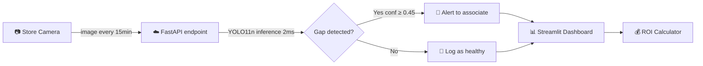

# RetailVision AI — Retail Shelf Gap Detection

Real-time stockout detection system using*YOLO11n for retail shelf monitoring. Identifies empty shelf spaces (gaps) from camera images to enable faster restocking and reduce revenue loss.


---

## The Problem

Retail stockouts cost the industry $1 trillion annually (IHL Group). Manual shelf walks happen only 2-3 times per day, leaving gaps undetected for hours. Each hour a gap exists, the store loses an estimated $75 in revenue per gap ($25 avg product × 30% customer walkaway rate × 10 customers/hour — see ROI Calculator in dashboard for adjustable assumptions).

## The Solution

RetailVision AI uses computer vision to detect shelf gaps in real-time from store camera images, alerting staff within minutes instead of hours.

---
## Dataset

[SRM University Retail Shelf Availability](https://universe.roboflow.com/srm-university-yleue/retail-shelf-availability)
from Roboflow Universe.

- **Source:** SRM University, hosted on Roboflow
- **Original:** 4,588 images (416×416), 2 classes, 23,015 annotations
- **After remediation:** 4,588 images, 21,891 gap annotations, single-class
- **License:** CC BY 4.0 (check Roboflow dataset page for current terms)

---
## Results

### Test Set Metrics (671 unseen images, threshold=0.45)

| Metric        | Value                      |
| ------------- | -------------------------- |
| **Precision** | 91.7%                      |
| **Recall**    | 90.0%                      |
| **mAP@50**    | 87.4%                      |
| **mAP@50-95** | 66.3%                      |
| **Inference** | 2.1ms/image (~475 img/sec) |

### Data Quality Audit

The original Roboflow dataset reported **98.8% mAP** — but an audit revealed:

- 56.8% cross-split data leakage (same source images in train and validation)
- 896 mislabeled class-0 annotations (visually verified as inconsistent)
- 228 undetectable tiny bounding boxes (<10px)

After remediation with GroupShuffleSplit and single-class refocus: 21,891 clean gap annotations across 4,588 images without leakage and 87.4% mAP on truly unseen test data.


---

## Architecture



---

## Key Features

### 1. Data Quality Pipeline
- SHA256 hash-based duplicate detection across splits
- GroupShuffleSplit to eliminate augmentation-based leakage
- Visual verification of annotation quality
- Tiny bounding box filtering (<10px)
- 11 automated leakage tests (3 test functions × parametrized variants, all passing)

### 2. Model Training
- **YOLO11n** (nano): 2.6M parameters, optimized for real-time inference
- Single-class detection (gap) after removing noisy class-0 annotations
- AdamW optimizer with cosine LR decay
- No overfitting: train and validation losses decrease in parallel across 50 epochs
- MLflow experiment tracking

### 3. Threshold Optimization
- F2-score sweep on validation set (10 thresholds)
- F2 prioritizes recall for retail cost asymmetry (missed stockout >> false alert)
- Visual validation on dense shelves led to threshold=0.45 over F2-optimal 0.30
- Production recommendation: shelf-type-aware thresholds per aisle

### 4. FastAPI Endpoint
```bash
# Start API
uvicorn src.api.app:app --host 0.0.0.0 --port 8000

# Test detection
curl -X POST "http://localhost:8000/detect" \
  -F "file=@shelf_image.jpg"

# Response
{
  "filename": "shelf_image.jpg",
  "threshold_used": 0.45,
  "detections": [
    {"class": "gap", "confidence": 0.88, "bbox": {"x1": 341, "y1": 473, "x2": 411, "y2": 578}}
  ],
  "summary": {"total_gaps": 1, "alert_level": "OK"}
}
```

### 5. Streamlit Dashboard
Interactive dashboard with 3 tabs:
- **Live Detection:** Upload image, see gap detections with confidence scores and alert levels
- **ROI Calculator:** Editable business assumptions with step-by-step revenue impact calculation
- **Model & Architecture:** Production pipeline diagram, model card, honest metrics comparison

```bash
streamlit run dashboard/app.py
```

---

## Quick Start

### Prerequisites
- Python 3.12+
- NVIDIA GPU (recommended for training; CPU works for inference)

### Installation

```bash
git clone https://github.com/marianunez-data/retailvision-ai.git
cd retailvision-ai

# Create virtual environment
python -m venv .venv
source .venv/bin/activate  # Linux/Mac
# .venv\Scripts\activate   # Windows

# Install dependencies
pip install -r requirements.txt

# Or with uv
uv sync
```

### Run Dashboard
```bash
streamlit run dashboard/app.py
```

### Run API
```bash
uvicorn src.api.app:app --host 0.0.0.0 --port 8000
```

### Run Tests
```bash
python -m pytest tests/ -v
```

---

## Tech Stack

| Category       | Tools                                     |
| -------------- | ----------------------------------------- |
| **ML/DL**      | PyTorch, YOLO11, Ultralytics              |
| **API**        | FastAPI, Uvicorn                          |
| **Dashboard**  | Streamlit                                 |
| **Tracking**   | MLflow, YAML config                       |
| **Testing**    | pytest (11 tests)                         |
| **Data**       | Pandas, NumPy, OpenCV                     |
| **Deployment** | Docker, compatible with AWS / GCP / Azure |

---

## Known Limitations

- **Domain shift:** Trained on US big-box retail shelves. Performance degrades on different store formats (neighborhood stores, different shelving, natural lighting). Production deployment requires fine-tuning per store type.
- **Dense shelf detection:** Lower confidence thresholds generate false positives for inter-product spacing in densely-packed aisles. Shelf-type-aware thresholds would mitigate this.
- **Dataset size:** 4,588 images is sufficient for MVP (Minimum Viable Product) but larger datasets would improve generalization.

---

## Future Work

- [ ] Shelf-type-aware thresholds (sparse vs dense aisles)
- [ ] Time-series forecasting for stockout prediction
- [ ] Docker containerization for cloud deployment
- [ ] Domain adaptation for different store formats

---

## Author

**Maria Camila Gonzalez Núñez**
Data Scientist & Analyst

- Portfolio: [marianunez-data.github.io](https://marianunez-data.github.io)
- LinkedIn: [linkedin.com/in/marianunez-data](https://linkedin.com/in/marianunez-data)
